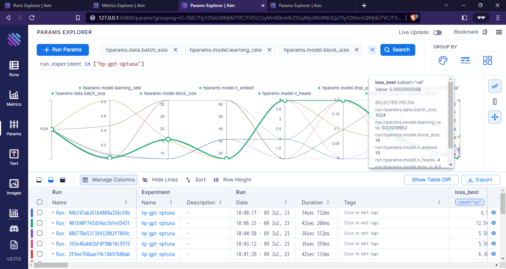
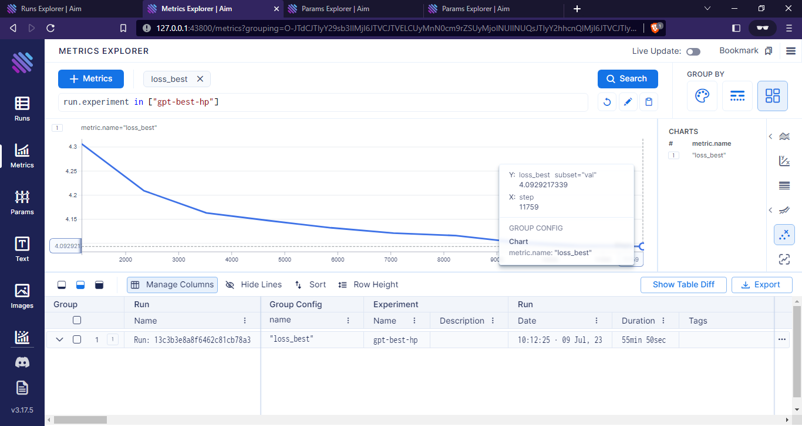
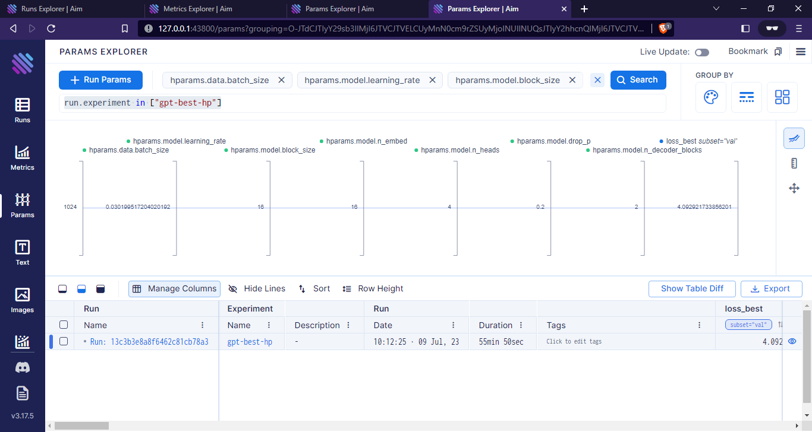

<div align="center">

# Session 7

</div>


## Introduction

In this session, we run a hyperparameter optimization for different parameters. For logging, we use [Aim](https://github.com/aimhubio/aim). The comparison is performed inside Aim's UI.


## Working

```
pip install -r requirements.txt --user && pip install -e . --user 
dlearn_train -m hparams_search=gpt_optuna experiment=s7
```

Each tuning run uses 100 steps/batches and for one epoch. A maximum of 20 trials were executed. At the end, the best hyperparameters from `optuna` and lightning's tuner are written to `tuner_results.yaml` and `optimization_results.yaml` respectively.

**Results for HyperParameter Tuning**

We can then run `localhost:43800` to view the logs.



Once the hyper-parameters have been optimized, we can run the training via

```
dlearn_train_hp experiment=s7 experiment_name=gpt-best-hp trainer.max_epochs=10
```

This script loads the results from the `*_results.yaml` files and updates the configuration before training the model for 10 epochs.




we can see that indeed the hyperparameters have been used for training


